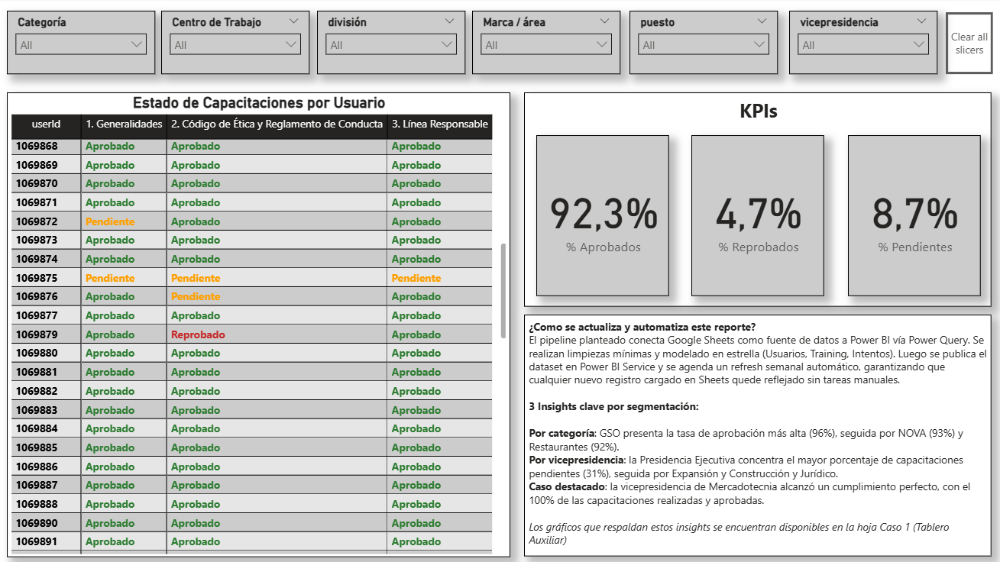
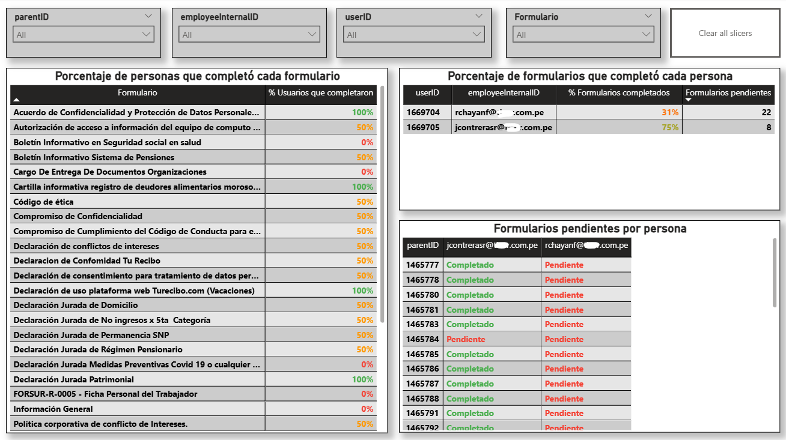
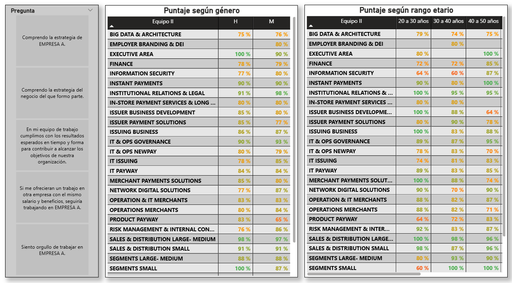

# 📊 CX Data Analyst Challenge

A technical data analytics challenge focused on end-to-end problem solving across four cases.  
Each case represents a real-world CX scenario, solved using Power BI, Power Query, DAX, and Python automation.

---

## 🧠 Overview

**Duration:** 1 week (Sept 2025)  
**Tools:** Power BI, Power Query, DAX, Python (pandas, smtplib), SQL, Google Sheets  
**Role:** Data Analyst – end-to-end delivery  
**Status:** Completed  

This project combines BI automation, Python scripting, and analytical modeling to create actionable, scalable data solutions.  
All datasets have been anonymized and adapted for educational purposes.

---

## 🧩 Project Structure

| Case | Topic | Tools | Description |
|------|--------|--------|-------------|
| 1 | Trainings Completion | Power BI | Track user training results dynamically across areas |
| 2 | Forms Completion | Power BI | Monitor form completion rates and pending items |
| 3 | Birthday Notifier | Python | Automate birthday reminders via email |  
| 4 | eNPS Analysis | Power BI | Calculate favorability scores by gender and age range |

---

## 🔍 Cases Summary

### 📘 Case 1 – Trainings Completion
Built a Power BI dashboard to track training progress per employee and training type, using color-coded states and automated refresh.  
**Outcome:** Real-time visibility of training performance and compliance.  

### 📄 Case 2 – Forms Completion
Designed a Power BI model to calculate completion percentages per form and per user, with dynamic recalculation through DAX.  
**Outcome:** Simplified compliance monitoring and eliminated manual spreadsheets.  

### 🐍 Case 3 – Birthday Notifier (Python)
Developed a small Python automation to detect daily birthdays and email managers automatically using `smtplib`.  
[View Notebook](https://colab.research.google.com/drive/1uF7XY9OE2RVXSosV8bCe-gU1QhRHE1F2?usp=sharing)  
**Outcome:** Removed repetitive admin work and improved timeliness.

### 📈 Case 4 – eNPS Analysis
Analyzed employee engagement results using favorability scores (% Agree + Strongly Agree) segmented by gender and age.  
**Outcome:** Clear insights into engagement strengths and opportunities.  

---

## 💡 Key Learnings
- Keep models modular and scalable (star schema + DAX).  
- Automate routine processes with lightweight Python scripts.  
- Focus on insight delivery rather than raw reporting.  

---

## 🚀 Next Steps
- Add global NPS metric to eNPS dashboard.  
- Expand automation scripts for other HR reminders.  
- Publish mock dataset for demo purposes.  

---

## 📜 License & Disclaimer
This project was developed as part of a technical challenge.  
All data has been anonymized and modified for educational use.  
No confidential or proprietary information is shared.

---

## 🧩 Connect
**LinkedIn:** [Joaquín Ferrer](https://www.linkedin.com/in/joaqu%C3%ADnferrer/)  
**Portfolio (Notion):** [View here](YOUR_NOTION_LINK)  
**GitHub:** [joacoferrer00](https://github.com/joacoferrer00)

